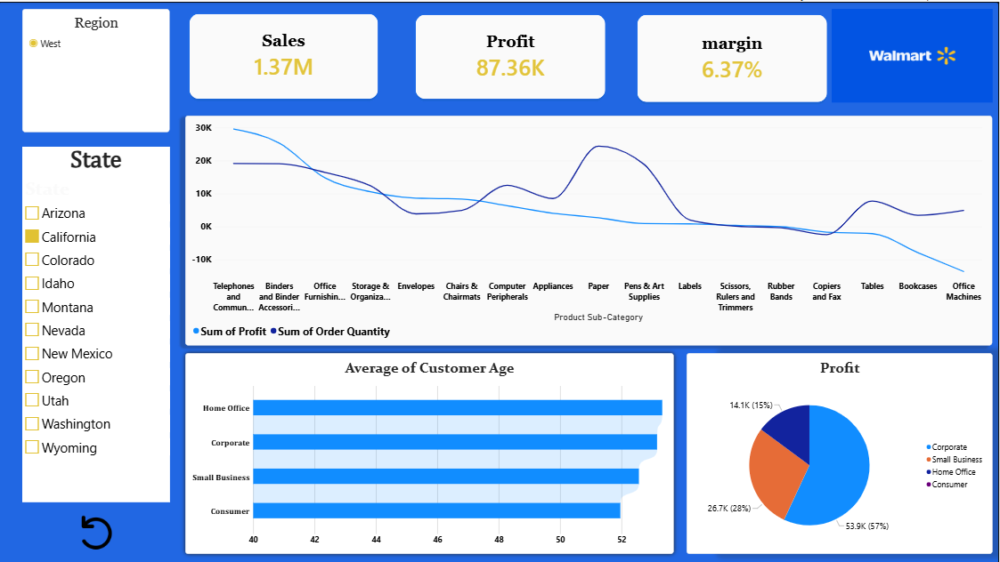

# Walmart_sales_analysis

1. -📝 Short Description /purpose
   To analyze Walmart retail sales data using Power BI to identify sales and profit trends across customers, regions, states, and products, while providing interactive insights for better business analysis and decision-making.

2. -Technologies / Tools
->Power BI
->Power Query
->Dax
->Data Visualization
->Data Cleaning & Transformation
->Excel 

3. -📊 Data Source
Source-https://www.kaggle.com/datasets/saadabdurrazzaq/walmart-retail-data
      Walmart Retail Data is an Excel dataset containing 8,399 rows and 25 columns of retail transaction data. It includes information about customers, orders, products, sales, profit, discounts, shipping, regions, and product categories.

4. -Features
🔴Business Problem
Walmart needs to understand which customers, products, and regions are contributing to sales and profit, and where losses are occurring. The business also needs to monitor profit margin and product-subcategory performance to identify areas that may require improvement.
🎯 Goal of the Dashboard
The main goal is to create an interactive Power BI dashboard that provides a clear view of Walmart's retail performance.
💼Business Impact
Improve profitability by identifying low-profit and loss-making product sub-categories.
Optimize product strategy by understanding which products contribute to profit.
Understand customers through segment-level profit and age analysis.
Monitor performance using Sales, Profit, and Margin KPIs.

 5. -Screenshots
    Show dashboard looks like :
   
    
